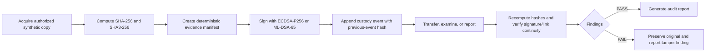
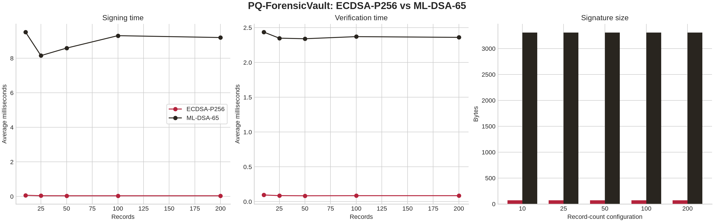

# Design and Evaluation of a Post-Quantum Chain-of-Custody Framework for Classical Digital Evidence

## A Reproducible Proof-of-Concept Study Using ECDSA-P256 and ML-DSA-65

**Author:** Goutham  
**Project:** PQ-ForensicVault  
**Document status:** Research-paper draft based on release `v2.2.2-readme-final`  
**Benchmark environment:** Node.js v22.13.0, Linux x64, `@noble/post-quantum@0.7.0`  
**Date:** 27 August 2026

---

## Abstract

Digital evidence must remain attributable, verifiable, and traceable from acquisition through examination, transfer, reporting, and later review. Conventional chain-of-custody workflows commonly combine cryptographic hashes, signed records, access controls, and audit logs, but the long-term security of classical public-key signatures is a relevant migration concern in the presence of cryptographically relevant quantum computers. This paper presents PQ-ForensicVault, a local-first proof-of-concept framework that evaluates how a post-quantum signature can be introduced into a digital-evidence chain-of-custody workflow without changing the underlying evidence-acquisition concept. The framework represents each evidence item and custody event through deterministic canonical data, computes SHA-256 and SHA3-256 digests, signs custody manifests with either ECDSA-P256 or ML-DSA-65, links events through previous-event hashes, and independently verifies artifact, metadata, event, and signature integrity. A controlled benchmark compares signing latency, verification latency, signature size, storage overhead, and modified-payload rejection across 10, 25, 50, 100, and 200 synthetic custody records. In the 50-record configuration, ECDSA-P256 averaged 0.0396 ms for signing and 0.0841 ms for verification with a 71.1-byte signature, while ML-DSA-65 averaged 8.5854 ms and 2.3403 ms with a 3,309-byte signature. Both methods rejected the controlled modified payloads in the recorded runs. The results demonstrate a security–performance–storage trade-off rather than a universal algorithmic winner. The contribution is an openly reproducible educational framework and evaluation method; it is not a validated forensic-acquisition suite, a production immutable ledger, or a determination of legal admissibility.

**Keywords:** digital forensics; digital evidence; chain of custody; post-quantum cryptography; ML-DSA; FIPS 204; ECDSA; integrity verification; reproducibility.

---

## 1. Introduction

Digital forensic conclusions depend on the ability to explain what was acquired, who handled it, which transformations occurred, and whether the examined material is the same material that was originally preserved. A chain of custody is therefore more than a list of timestamps: it is a structured account of evidence identity, handling actions, responsible actors, and continuity. Cryptographic hashes can reveal whether checked bytes or canonical records changed, while digital signatures can bind a record to a signing key. These controls support technical integrity, but they do not independently establish legal admissibility, procedural compliance, or the competence of the people who operate the process.

The emergence of post-quantum cryptography creates a second, forward-looking design question. Classical public-key systems such as elliptic-curve signatures are widely used because they are compact and efficient. However, a sufficiently capable quantum computer would threaten the security assumptions of some classical public-key mechanisms. The practical response is not to discard every existing forensic workflow, but to understand migration paths, compatibility constraints, and operational costs. NIST’s FIPS 204 specifies ML-DSA as a digital-signature standard intended for generation and verification of signatures and describes it as believed secure against adversaries possessing a large-scale quantum computer [1].

This paper studies the problem through PQ-ForensicVault, a local-first web prototype for synthetic evidence and controlled custody events. Its central design question is: **Can a standardized post-quantum signature be added to a familiar evidence-manifest and custody-event workflow while preserving independent verification and making the resulting performance and storage costs measurable?** The system is designed around three distinctions. Hashing detects changes; signatures provide signer association and authenticity evidence; and a hash-linked custody log records event order. Optional confidentiality mechanisms such as ML-KEM and AES-256-GCM are treated as future extension points rather than claimed features of the current evaluation.

The study makes four contributions. First, it defines an operational R1–R10 requirement model for a post-quantum-aware chain-of-custody workflow. Second, it implements the workflow with a server-side ECDSA-P256 baseline and a genuine ML-DSA-65 adapter. Third, it evaluates measurable trade-offs using reproducible synthetic records and records environment metadata. Fourth, it documents the system’s limits, including the difference between a local prototype and a production forensic platform.

### 1.1 Research questions

**RQ1.** How can ML-DSA-based digital signatures be integrated into an existing digital-evidence chain-of-custody workflow without changing the underlying forensic acquisition process?

**RQ2.** What are the differences in signing latency, verification latency, signature size, and storage overhead between ECDSA-P256 and ML-DSA-65 for custody-event manifests?

**RQ3.** How reliably does the proposed framework detect modification of evidence files, evidence metadata, and custody-event records?

**Optional RQ4.** How could ML-KEM be combined with AES-256-GCM to protect the confidentiality of long-term evidence transfers in a future version?

### 1.2 Scope and contribution boundary

The prototype uses self-created or synthetic evidence and simulated custody events. It does not acquire real seized devices, process confidential case data, preserve quantum states, collect quantum-control-pulse logs, or establish a court’s acceptance of a particular cryptographic design. The claims in this paper are limited to the implemented workflow, measured runtime, controlled tamper tests, and documented reproducibility procedure.

---

## 2. Background and related work

### 2.1 Digital evidence and custody continuity

Digital evidence is unusually easy to copy and modify while remaining visually plausible. A robust workflow therefore needs a stable evidence identifier, an artifact digest, metadata describing the acquisition or handling context, and a record of subsequent events. PQ-ForensicVault treats the artifact and its custody history as related but distinct objects: the artifact is stored through a storage reference, while custody events describe actions performed on or about that artifact.

The framework follows the established idea that an evidence log can preserve accountability without storing the complete evidence bytes inside every record. The system stores hashes and metadata in the custody event, while the artifact itself is addressed through the storage layer. This separation reduces database bloat and allows the verification procedure to recalculate digests independently.

Blockchain-oriented forensic research has explored distributed or append-only representations of chain-of-custody information. Al-Khateeb, Epiphaniou, and Daly discuss the chain of custody as a distributed ledger for modern digital forensics [3]. Lone and Mir’s Forensic-chain work proposes blockchain-based custody recording and tamper resistance [4]. Bonomi, Casini, and Ciccotelli describe B-CoC as a blockchain-based chain-of-custody approach for evidence management [5]. PQ-ForensicVault adopts the useful integrity concept of linked event records but deliberately does not claim blockchain consensus, decentralisation, or the legal effects of a blockchain.

### 2.2 Quantum threats and post-quantum signatures

Overill’s work on digital quantum forensics frames the need to reconsider forensic investigation techniques in response to quantum-computing challenges [2]. The present paper addresses a narrower engineering problem: migration of custody-event authentication for classical digital evidence. It does not claim to perform live forensics on a quantum computer.

NIST FIPS 204 standardizes ML-DSA, a module-lattice-based digital-signature family [1]. FIPS 203 separately specifies ML-KEM for key encapsulation, while FIPS 205 specifies SLH-DSA as a stateless hash-based signature standard [6] [7]. In this prototype, ML-DSA-65 is the post-quantum comparison method because the research questions focus on signatures for custody-event manifests. ML-KEM is mentioned as a future confidentiality-layer option and is not included in the reported benchmark.

A key implication of post-quantum migration is that security properties are not free of operational cost. Post-quantum signatures and public keys can be substantially larger than compact elliptic-curve alternatives, and implementation performance depends on the library, runtime, hardware, payload, and measurement method. This paper therefore reports measured values and their environment rather than presenting a universal ranking.

### 2.3 Research gap

The supplied literature matrix contains work on quantum-forensics challenges, blockchain custody, evidence cabinets, post-quantum benchmarking, and operational chain-of-custody models. These areas are valuable but often treated separately. The gap addressed here is an openly reproducible, end-to-end educational prototype that combines a classical baseline, a standardized post-quantum signature adapter, deterministic evidence manifests, linked custody events, independent verification, controlled tamper tests, and a documented benchmark.

The gap claim is intentionally modest. This study does not claim that no other prototype exists. It claims that the present artifact provides a coherent and inspectable integration of the selected functions for the research questions and makes its own evidence, measurements, and limitations available for reproduction.

---

## 3. Framework requirements and design

The following requirements operationalize the paper’s chain-of-custody objectives. They are study requirements defined for this prototype, not a claim that every jurisdiction or forensic laboratory uses the same ten requirements.

| Requirement | Framework obligation | Implemented evidence |
|---|---|---|
| R1 — Authorized acquisition | Accept only synthetic, self-created, or lawfully authorized evidence copies | Local-first acquisition and permitted-file workflow |
| R2 — Evidence identity | Assign a stable case/evidence identifier and preserve artifact metadata | Evidence records and case model |
| R3 — Integrity digest | Calculate independent artifact and metadata digests | SHA-256 and SHA3-256 |
| R4 — Canonical manifest | Serialize signed fields deterministically | Server-side canonical event serialization |
| R5 — Signature association | Sign a custody manifest and retain the verification material | ECDSA-P256 and ML-DSA-65 paths |
| R6 — Event continuity | Preserve event ordering and previous-event linkage | Hash-linked custody events |
| R7 — Controlled transfer | Record actor, action, timestamp, location, reason, and transfer status | Custody-event fields and handover procedure |
| R8 — Independent verification | Recalculate digests, links, and signatures instead of trusting the UI | Verification center and server-side findings |
| R9 — Tamper evidence and reporting | Reject modified copies and export an audit trail | Tamper laboratory plus Markdown/JSON/CSV exports |
| R10 — Reproducibility and disclosure | Record environment, parameters, adapter status, limitations, and commands | Benchmark JSON, documentation, tests, and runtime disclosure |

### 3.1 Separation of security functions

The framework keeps five functions conceptually separate. **Hashing** detects changes to checked bytes or canonical fields. **Digital signatures** associate a signed record with a signing key and support verification by a third party. **The hash-linked log** records sequence and continuity; it does not create decentralised consensus. **Encryption** would protect confidentiality and is not supplied merely by hashing or signing. **Post-quantum cryptography** changes the signature security assumption for future attackers but introduces key, signature, storage, and performance costs.

### 3.2 Workflow



### 3.3 Threat model

The prototype considers accidental artifact modification, altered metadata, modified custody events, removed or reordered events, wrong signing keys, forged post-quantum measurements, malicious uploads, and unsafe tamper demonstrations. It mitigates these threats through recalculated digests, canonical payloads, signature verification, previous-event hashes, adapter self-tests, permitted-file checks, and isolated tamper copies.

The system does not solve key compromise, hardware-backed key protection, malicious administrators who can rewrite the entire local database, physical-media protection, malware analysis, authenticated multi-organisation consensus, or legal procedure. These are important production concerns and are treated as explicit limitations rather than hidden assumptions.

---

## 4. Methodology

### 4.1 Research design

The study uses a design-science approach. The artifact is designed from the research questions, implemented as a working prototype, evaluated with controlled synthetic records, and documented for independent reproduction. The evaluation is not a field trial and does not estimate courtroom outcomes or laboratory-wide operational performance.

### 4.2 Data generation and canonicalization

The benchmark generates synthetic custody-record payloads containing stable identifiers, investigator metadata, timestamps, actions, locations, transfer status, and evidence-hash fields. The same canonical record design is used for the ECDSA-P256 and ML-DSA-65 paths. Before signing, the event fields are serialized deterministically so that a verifier can reconstruct the same message. A tamper test changes a signed canonical field after signing; successful tamper detection means that verification rejects the modified payload.

The application also supports controlled registration of permitted TXT, PDF, JPEG, PNG, WebP, and GIF copies below 2 MB. Those files support the interface demonstration and integrity workflow. They are not substitutes for a validated forensic imaging process and are not the basis for claiming security of large disk images.

### 4.3 Implementation

The client is a React 19 interface with a Crimson-and-cream blueprint visual language. It communicates with typed tRPC procedures hosted by an Express server. The server owns canonicalization, hashing, signing, verification, role checks, custody continuity, benchmark execution, and report rendering. The database layer stores case, evidence, investigator, custody, benchmark, and verification metadata; the storage abstraction keeps artifact bytes separate from metadata.

ECDSA-P256 is implemented as the classical baseline through the Node.js cryptographic API [8]. ML-DSA-65 is executed through the `@noble/post-quantum@0.7.0` adapter. The adapter is considered active only after key generation, signing, verification, and modified-payload rejection succeed. If the adapter is unavailable in another environment, the correct output is an explicit unavailable status and no fabricated post-quantum measurements.

### 4.4 Verification procedure

Verification independently retrieves or reads the referenced artifact, recalculates SHA-256 and SHA3-256, reconstructs the canonical evidence and event values, checks the event-record hash, checks the previous-event hash, and verifies the stored signature against its public key. A failed finding is returned as a diagnostic result. The original evidence is not mutated by a tamper test; the laboratory operates against a controlled artifact or ledger copy and provides a reset operation.

### 4.5 Evaluation metrics

| Metric | Operational definition |
|---|---|
| Signing latency | Time to sign one canonical custody payload |
| Verification latency | Time to verify one signature and canonical payload |
| Signature size | Serialized signature length in bytes |
| Public-key size | Serialized public-key length in bytes |
| Storage overhead | Signature storage contribution recorded for the event |
| Tamper rejection | Whether a modified signed payload is rejected |
| Reproducibility metadata | Node version, operating system, package version, configuration, sample count, and repetitions |

---

## 5. Implementation and system architecture

The implementation is divided into a browser presentation layer, a typed server boundary, cryptographic primitives, persistence and storage adapters, and report/benchmark utilities. The browser is not treated as the cryptographic source of truth. The server performs the security-relevant calculations and returns structured findings to the interface.

The core event contains case and evidence identifiers, actor, action, UTC timestamp in milliseconds, location, reason, transfer status, previous-event hash, event-record hash, signature algorithm, signature, and public key. The event-record hash covers the canonical record fields. The previous-event hash links the event to its predecessor, allowing verification to identify sequence breaks or record replacement.

The prototype is local-first but retains integration boundaries for managed database, object storage, authentication, and role controls. In local demonstration mode, synthetic cases and safe copies are sufficient to exercise the workflow. A production deployment would require authenticated storage, encrypted transport and retention, hardware-backed or otherwise controlled key custody, formal access review, audit-log protection, backup and recovery, secure time handling, and independent security testing.

---

## 6. Evaluation and results

### 6.1 Experimental configuration

The final run used record-count configurations of 10, 25, 50, 100, and 200. The first four configurations used three repetitions; the 200-record configuration used two repetitions. The effective samples were therefore 30, 75, 150, 300, and 400. The same record structures and measurement strategy were used for both algorithms.

| Records | Repetitions | Effective samples |
|---:|---:|---:|
| 10 | 3 | 30 |
| 25 | 3 | 75 |
| 50 | 3 | 150 |
| 100 | 3 | 300 |
| 200 | 2 | 400 |

### 6.2 Measured comparison

| Records | ECDSA sign avg. (ms) | ML-DSA sign avg. (ms) | ECDSA verify avg. (ms) | ML-DSA verify avg. (ms) | ECDSA signature (bytes) | ML-DSA signature (bytes) |
|---:|---:|---:|---:|---:|---:|---:|
| 10 | 0.0696 | 9.5101 | 0.0954 | 2.4354 | 71 | 3309 |
| 25 | 0.0421 | 8.1508 | 0.0862 | 2.3487 | 71.1 | 3309 |
| 50 | 0.0396 | 8.5854 | 0.0841 | 2.3403 | 71.1 | 3309 |
| 100 | 0.0395 | 9.3049 | 0.0854 | 2.3707 | 71 | 3309 |
| 200 | 0.0393 | 9.1969 | 0.0854 | 2.3600 | 71 | 3309 |

At 50 records, ML-DSA-65 signing was approximately 216.8 times the ECDSA-P256 average in this run, verification was approximately 27.8 times the ECDSA average, and the signature was approximately 46.5 times larger. These ratios are descriptive calculations from one environment and should not be generalized to other hardware, libraries, payload sizes, or runtimes.

The ML-DSA adapter reported a 1,952-byte public key, a 4,032-byte secret key, and a 3,309-byte signature. The ECDSA path reported a 91-byte public key, a 138-byte private-key representation, and an approximately 71-byte signature in the benchmark records. Private signing material is not returned to the browser by the application.

### 6.3 Integrity results

The recorded ECDSA and ML-DSA benchmark paths rejected their controlled modified canonical payloads. The application’s end-to-end workflow additionally tests modified artifact copies and modified ledger copies, returning failed verification findings while preserving the original evidence. This demonstrates controlled tamper detection, not an absolute guarantee against every attack or a substitute for secure evidence handling.



*Figure 1. Final benchmark comparison generated from `benchmark-results.json` using the headless plotting script. The underlying JSON and CSV files are the authoritative machine-readable artifacts.*

### 6.4 Research-question answers

**RQ1:** ML-DSA can be introduced at the custody-manifest signing boundary without changing the conceptual acquisition process. The artifact is hashed and represented by a canonical manifest; the selected signature path then signs the custody event. This preserves the separation between evidence acquisition and event authentication. A production migration would still require key management, interoperability testing, algorithm-agility design, and policy approval.

**RQ2:** In the recorded runtime, ML-DSA-65 had materially higher signing and verification latency and substantially larger signatures than ECDSA-P256. The result supports a migration trade-off conclusion: post-quantum signatures can improve long-term cryptographic posture while increasing storage and processing requirements.

**RQ3:** The controlled tests rejected modified canonical payloads, and the application’s verification and tamper paths detect modified artifact and ledger copies. The result supports the claim that the implemented integrity checks detect the tested modifications. It does not establish detection of every possible operational failure or malicious administrator scenario.

**RQ4:** ML-KEM and AES-256-GCM are identified as an extension path for confidentiality, but they were not implemented or benchmarked in this final prototype. No ML-KEM performance or security result is claimed.

---

## 7. Discussion

The main result is not that ML-DSA is “better” than ECDSA. The result is that algorithm choice changes the operational shape of a custody system. ECDSA-P256 is compact and fast in the measured setup. ML-DSA-65 provides a standardized post-quantum signature option, but its signatures and public keys are larger and its measured operations are slower in this JavaScript runtime. For a system that appends many events, the storage effect may matter as much as the cryptographic operation time.

The design also shows why cryptographic controls should not be collapsed into one vague notion of immutability. A hash does not identify the author of a record. A signature does not preserve the sequence of all events. A linked log does not provide confidentiality. Encryption does not prove that an event was authorized. A research prototype is clearer and more defensible when each mechanism is assigned a narrow role and independently tested.

The prototype’s safe tamper laboratory is important for demonstration quality. It gives a presenter a visible PASS → controlled modification → FAIL → reset → PASS sequence without corrupting the original evidence record. This is appropriate for a classroom or research demonstration. It must not be described as equivalent to a production immutable ledger, a permissioned blockchain with independent validators, or a validated forensic exhibit-management system.

Standards alignment is similarly bounded. FIPS 204 provides the ML-DSA algorithm standard; it does not certify this application’s key management, user identity, evidence acquisition, audit process, or legal admissibility. The project therefore reports the standard and implementation package, but does not claim FIPS validation of the complete application.

---

## 8. Limitations and deployment considerations

First, the benchmark is a controlled microbenchmark of canonical custody records, not a capacity test of large forensic images. The prototype hashes permitted demonstration files, but it signs compact manifests rather than repeatedly signing complete disk images. Hardware, operating-system scheduling, Node.js version, package implementation, timer resolution, payload size, and background load can change the measurements.

Second, the experiment uses synthetic records and controlled modifications. It does not measure investigator error rates, multi-organisation handover behaviour, chain-of-custody admissibility, or the effect of real forensic imaging tools. The 100% controlled rejection outcome means all tested modifications were rejected in the recorded run; it is not a probabilistic guarantee for all attack classes.

Third, the current artifact is not a production security boundary. It needs a formal key lifecycle, hardware-backed or independently protected signing keys, stronger authenticated access control, encrypted storage and transport, secure time and timestamp policy, immutable or externally anchored audit storage, backup and recovery, vulnerability management, and independent review before operational use.

Fourth, ML-KEM and AES-256-GCM are not part of the evaluated implementation. The paper should not describe confidentiality protection as implemented. Similarly, the application does not perform physical quantum-computer forensics or collect quantum-device artifacts.

Finally, the literature matrix supplied for the study contained several candidate DOI and metadata entries that required verification. This paper uses authoritative NIST links and publisher or repository links where available and avoids treating unresolved candidate metadata as verified fact. Before submission, the author should recheck every bibliographic record against the publisher page, DOI registry, or official repository and update the final reference list accordingly.

---

## 9. Conclusion and future work

This paper presented PQ-ForensicVault, a reproducible proof-of-concept framework for post-quantum-aware digital-evidence chain of custody. The framework preserves a familiar acquisition-to-report workflow while separating artifact hashing, signer association, event continuity, confidentiality, and post-quantum migration. It implements ECDSA-P256 as a classical baseline and genuine ML-DSA-65 execution through a validated adapter. The final experiment measured both methods across five synthetic record-count configurations and showed a clear operational trade-off: ML-DSA-65 was slower and substantially larger in the measured environment, while both signature paths rejected the controlled modified payloads.

The work answers the research questions at prototype level. ML-DSA can be placed at the custody-manifest boundary without changing the conceptual evidence-acquisition process; the measured costs are visible and reproducible; and the implemented integrity checks detect the tested artifact, metadata, and event modifications. The contribution is therefore an inspectable migration experiment, not a claim of universal post-quantum superiority.

Future work should add ML-KEM plus authenticated symmetric encryption for evidence-transfer confidentiality, support algorithm agility and hybrid signatures, integrate authenticated time and external audit anchoring, evaluate larger and more diverse payloads, compare multiple maintained implementations, test hardware-backed key custody, and conduct a usability study with forensic practitioners. A later deployment study should also examine standards compliance, retention, access review, incident response, and jurisdiction-specific evidentiary requirements.

---

## 10. Reproducibility statement

The source code, benchmark outputs, plotting script, test suite, architecture notes, experiment protocol, and final validation record are maintained in the public repository [Prototype-PQCOC](https://github.com/Gooichand/Prototype-PQCOC). The documentation-inclusive release is tagged `v2.2.1-reproducibility-docs`; the README refinement is tagged `v2.2.2-readme-final`.

A clean reproduction uses:

```bash
git clone https://github.com/Gooichand/Prototype-PQCOC.git
cd Prototype-PQCOC
git checkout v2.2.2-readme-final
pnpm install --frozen-lockfile
pnpm test
pnpm check
pnpm build
pnpm benchmark
pnpm benchmark:plot
pnpm dev
```

The generated files are `benchmark-results.json`, `benchmark-results.csv`, `BENCHMARK_RESULTS.md`, and `benchmark-comparison.png`. The authoritative methodological details are in `EXPERIMENTS.md`; the component and threat-model details are in `ARCHITECTURE.md`; the final gate record is in `docs/FINAL_VALIDATION.md`.

---

## References

[1]: https://doi.org/10.6028/NIST.FIPS.204 "NIST FIPS 204: Module-Lattice-Based Digital Signature Standard"

[2]: https://www.inderscienceonline.com/doi/abs/10.1504/IJITCC.2012.050410 "Overill, Digital quantum forensics: future challenges and prospects"

[3]: https://research.aston.ac.uk/en/publications/blockchain-for-modern-digital-forensics-the-chain-of-custody-as-a "Al-Khateeb, Epiphaniou, and Daly, Blockchain for Modern Digital Forensics: The Chain-of-Custody as a Distributed Ledger"

[4]: https://www.sciencedirect.com/science/article/abs/pii/S174228761830344X "Lone and Mir, Forensic-chain: Blockchain based digital forensics chain of custody with PoC in Hyperledger Composer"

[5]: https://arxiv.org/abs/1807.10359 "Bonomi, Casini, and Ciccotelli, B-CoC: A Blockchain-based Chain of Custody for Evidences Management in Digital Forensics"

[6]: https://csrc.nist.gov/pubs/fips/203/final "NIST FIPS 203: Module-Lattice-Based Key-Encapsulation Mechanism Standard"

[7]: https://csrc.nist.gov/pubs/fips/205/final "NIST FIPS 205: Stateless Hash-Based Digital Signature Standard"

[8]: https://nodejs.org/api/crypto.html "Node.js Crypto API documentation"

---

## Appendix A. Artifact map

| Artifact | Purpose |
|---|---|
| `server/forensicCore.ts` | Canonicalization, hashing, ECDSA operations, ML-DSA capability, verification, and report primitives |
| `server/crypto/mldsaAdapter.ts` | ML-DSA-65 key generation, signing, verification, parameter metadata, and adapter validation |
| `server/routers/forensics.ts` | Typed case, evidence, custody, verification, benchmark, tamper, dashboard, and export procedures |
| `server/workflow.e2e.test.ts` | End-to-end workflow regression coverage |
| `benchmark-runner.ts` | Reproducible ECDSA/ML-DSA measurement runner |
| `scripts/plot_benchmarks.py` | Headless benchmark visualization generator |
| `benchmark-results.json` | Machine-readable benchmark source |
| `benchmark-results.csv` | Tabular benchmark export |
| `BENCHMARK_RESULTS.md` | Human-readable benchmark table |
| `benchmark-comparison.png` | Final benchmark plot |
| `ARCHITECTURE.md` | Component map, data flow, trust boundaries, and threat model |
| `EXPERIMENTS.md` | Parameters, commands, measurement definitions, and interpretation rules |
| `docs/FINAL_VALIDATION.md` | Final release validation record |

## Appendix B. Paper-to-prototype traceability

| Paper claim | Source of evidence |
|---|---|
| The workflow hashes and signs canonical records | `server/forensicCore.ts`, `server/crypto/mldsaAdapter.ts` |
| Custody sequence is hash-linked | `ARCHITECTURE.md`, custody continuity tests |
| Modified payloads are rejected | ML-DSA adapter tests, ECDSA benchmark outcomes, workflow tests |
| Benchmark values are reproducible | `EXPERIMENTS.md`, `benchmark-runner.ts`, `benchmark-results.json` |
| Visual comparison is generated from measured data | `scripts/plot_benchmarks.py`, `benchmark-comparison.png` |
| Legal admissibility is not claimed | `ARCHITECTURE.md`, `DELIVERY.md`, this paper’s limitations |
